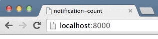

# notification-count

Lightweight helper to keep track of notifications in your title (or your preferred element).

[Demo](https://anthonyringoet.github.io/notification-count/example/)



[
](https://ci.testling.com/anthonyringoet/notification-count)

## Install

```
npm install notification-count
```

## Api
```
var N = require('notification-count');

// create instance
// optional arguments:
// - count = default count
// - el = element to show the notifications, defaults to document.title
// - left = left separator, default to '('
// - right = right separator, default to ')'

var n = new N();

// add 1 or optional argument
n.add();

// subtract 1 or optional argument
n.subtract();

// set a specific value
n.set();

// set the initial value
// which is 0 or the value you chose yourself
n.default();
```